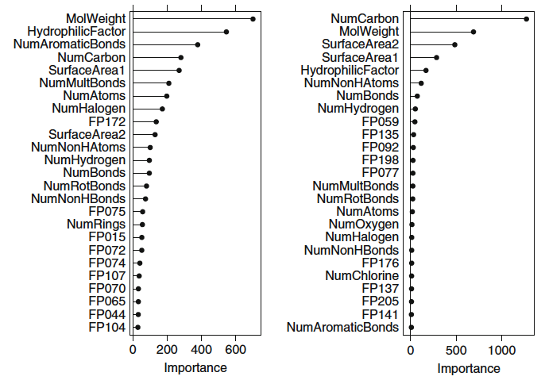

```{r setup, include=FALSE}
knitr::opts_chunk$set(echo=TRUE, warning=FALSE, message=FALSE)
library(tibble)
library(ggplot2)
library(caret)
library(doParallel)
library(RANN)
library(elasticnet)
library(brnn)
library(earth)
library(kernlab)
library(data.table)
library(gbm)
library(VIM)
cl <- parallel::makePSOCKcluster((parallel::detectCores() * 0.5))
registerDoParallel(cl)
```
# KJ Question 6.3
## Question
A chemical manufacturing process for a pharmaceutical product was
discussed in Sect. 1.4. In this problem, the objective is to understand the
relationship between biological measurements of the raw materials (predictors),
measurements of the manufacturing process (predictors), and the response of
product yield. Biological predictors cannot be changed but can be used to assess
the quality of the raw material before processing. On the other hand,
manufacturing process predictors can be changed in the manufacturing process.
Improving product yield by 1\% will boost revenue by approximately one hundred
thousand dollars per batch:

  (a) Start R and use these commands to load the data:

```
library(AppliedPredictiveModeling)
data(chemicalManufacturingProcess)
```

  The matrix `processPredictors` contains the 57 predictors (12 describing the
  input biological material and 45 describing the process predictors) for the
  176 manufacturing runs. yield contains the percent yield for each run.

  (b) A small percentage of cells in the predictor set contain missing values.
  Use an imputation function to fill in these missing values (e.g., see Sect.
  3.8).

  (c) Split the data into a training and a test set, pre-process the data, and
  tune a model of your choice from this chapter. What is the optimal value of
  the performance metric?

  (d) Predict the response for the test set. What is the value of the performance
  metric and how does this compare with the resampled performance metric on the
  training set?

  (e) Which predictors are most important in the model you have trained? Do
  either the biological or process predictors dominate the list?

  (f) Explore the relationships between each of the top predictors and the
  response. How could this information be helpful in improving yield in future
  runs of the manufacturing process?

## Answers
The excellent `caret` package will be used to coordinate the supervised
learning, together with any necessary packages. For convenience, data frames may
be turned into `data.tables`.

In general, it is considered optimal to split the data into three pieces:
training, validation, and testing. Where the training set is used to train a
model of a given type, the validation set is used to estimate the prediction
error for the model, and the test set only brought out at the end to estimate
general error (Hastie et al 2001, p. 222). However, as we are only supposed to
pick one model for this exercise, the data will be broken into two pieces.

### Part (a)
```{r KJ63a}
library(AppliedPredictiveModeling)
data(ChemicalManufacturingProcess)
CMP <- as.data.table(ChemicalManufacturingProcess)
```

### Part (b)
There are data fields with missing observations.

```{r KJ63b}
knitr::kable(unlist(CMP[, lapply(.SD, function (x) {sum(is.na(x))})])[
  which(CMP[, lapply(.SD, function (x) {sum(is.na(x))})
  ] > 0)],
  col.names = "NumMissing", format = 'pandoc')
```

The values will be imputed using KU+2212nearest neighbors which also automatically
implies a centering and scaling of the data. If imputation is desired without
centering and scaling, one may use a baggedU+2212tree imputation method instead.

### Part (c)
The data will be divided equally, and randomly, into a training and test set.
For repeatability, a random seed will be set.

```{r KJ63c1}
set.seed(674835)
trainObs <- sample.int(n = dim(CMP)[[1]], size = dim(CMP)[[1]] %/% 2)
trainCMPX <- as.matrix(CMP[trainObs, -1])
trainCMPY <- unlist(CMP[trainObs, 1])
testCMPX <- as.matrix(CMP[-trainObs, -1])
testCMPY <- unlist(CMP[-trainObs, 1])
```

The model selected from the chapter will be an elastic net, combining the (best)
features of ridge regression and the feature selection of lasso. The tuning will
be based on a fiveU+2212time repeated 11-fold cross validation, as both the training
and testing data have 88 observations. The tuning will use
RMSE as the performance metric to optimize.

Furthermore, initial training showed that there were columns with zero or
near-zero variance. These will be pre-processed as well. Lastly, the default
in caret is to provide a grid of three values for the ridge lambda and three for
the \(L_1\) fraction used for the lasso component. For this problem, a large
number of very fine mesh grids were tried, with one zoomed in on the best result
supplied below.

```{r KJ63c2}
fitControl <- trainControl(method = "repeatedcv", number = 11L, repeats = 5L)
tGrid <- expand.grid(fraction = seq(0.028, 0.029, 1e-4),
                     lambda = c(0, 1e-4, 1e-3))
elastiFit <- train(x = trainCMPX, y = trainCMPY, method = 'enet',
                   preProcess = c('zv', 'nzv', 'knnImpute'),
                   trControl = fitControl, tuneGrid = tGrid)
```

The value of the performance at the selected optimal point is an RMSE of
`r min(elastiFit$results$RMSE)` at an \(L_1 \) fraction of
`r elastiFit$bestTune[[1]]` and a ridge lambda of `r elastiFit$bestTune[[2]]`.
Note that this is thus actually a true lasso fit!

### Part (d)
```{r KJ63d}
elastiPred <- predict(elastiFit, testCMPX)
testResult <- defaultSummary(data.frame(obs = testCMPY,  pred = elastiPred))
```

The RMSE for the test data set is `r testResult[[1]]` which is greater than that
for the training set. This is to be expected, as there is bound to be be some
overfitting on the training set, despite the use of cross-validation.

### Part (e)
The top 10 variables by importance are shown below:
```{r KJ63e}
elastiVarImp <- varImp(elastiFit)
nI <- names(CMP)[-1]
t10E <- data.frame(nI, elastiVarImp$importance)[
  order(elastiVarImp$importance, decreasing = TRUE)[1:10], ]
t10EN <- t10E$nI
knitr::kable(t10E, row.names = FALSE, format = 'pandoc', digits = 2)
```

For this fit, the **Manufacturing** components completely dominate the list.

### Part (f)
```{r KJ63f, fig.height=8L, fig.width=10L}
par(mfrow = c(4, 3))
for (i in seq_along(t10EN)) {
  plot(x = unlist(CMP[, .SD, .SDcols = t10EN[i]]), CMP$Yield,
       xlab = t10EN[i], ylab = "Yield")
}
par(mfrow = c(1, 1))
```

`r t10EN[1]`, `r t10EN[7]`, and to a lesser extent `r t10EN[5]` demonstrate a
positive relation with yield. Conversely, `r t10EN[2]` and `r t10EN[3]` appear
to be negatively correlated with yield. The remaining variables could almost be
outlier examples from Anscombe's famous quartet.

At this point, I would suggest that another model family should be investigated
and test-set behavior should be compared.

# KJ Question 7.2
Friedman (1991) introduced several benchmark data sets create by simulation.
One of these simulations used the following nonlinear equation to create data:
\[
y = 10\sin(\pi x_1 x_2) + 20\left(x_3 − 0.5\right)^2 + 10x_4 +5x_5 +
\mathcal{N}\left(0, \sigma^2\right)
\]

where the \(x\) values are random variables uniformly distributed between
\([0, 1]\) (there are also 5 other non-informative variables also created in the
simulation). The package `mlbench` contains a function called
`mlbench.friedman1` that simulates these data.

Tune several models on these data. 

Which models appear to give the best performance? Does MARS select the
informative predictors (those named `X1–X5`)?

```{r KJ7.2}
library(mlbench)

set.seed(42)
train <- mlbench.friedman1(200, sd = 1)
train$x <- data.frame(train$x)

test <- mlbench.friedman1(5000, sd = 1)
test$x <- data.frame(test$x)

featurePlot(train$x, train$y)
```

We see each of the features plotted against the target. The first 5 features
(`X1-X5`) are predictive of the target, whereas the last 5 features have no
correlation with the target. It appears that `X1` and `X4` have the highest
correlation with the target, `X2` and `X5` have a looser correlation with the
target, and `X3` may have a quadratic relationship with the target.

```{r KJ7.2elastic}
cv_control <- trainControl(method = 'cv')

elasticnet_model <- train(train$x, train$y, method = 'glmnet', tunelength = 10,
                          trControl = cv_control)

coef(elasticnet_model$finalModel, elasticnet_model$bestTune$.lambda)[,63]

elasticPred <- predict(elasticnet_model, newdata = test$x)

postResample(pred = elasticPred, obs = test$y)
```

We can see from the model coefficients that even a simple elastic net is
generally recognizing the more predictive features as being more important.

The simple elastic net model has an RMSE of 2.69 and an R squared of 0.72.

```{r KJ7.2NN}
nnet_grid <- expand.grid(.decay = c(0, 0.1, 1), .size = c(1:10), .bag = F)

nnet_model <- train(train$x, train$y, method = 'avNNet', tuneGrid = nnet_grid,
                    preProc = c('center', 'scale'), linout = T, trace = F)

nnet_model$bestTune

nnetPred <- predict(nnet_model, newdata = test$x)

postResample(pred = nnetPred, obs = test$y)
```

The features are all uncorrelated enough to warrant using all of them in the
neural net model. We preprocess the data by standardizing it in order to have
all features on the same scale. The simple neural network model performs best
with 4 neurons and has an RMSE of 2.17 and an R squared of 0.81.

```{r KJ7.2MARS, warning = F}
mars_grid <- expand.grid(.degree = c(1,2), .nprune = c(2:38))

mars_model <- train(train$x, train$y, method = 'earth', tuneGrid = mars_grid,
                    trControl = cv_control)

marsPred <- predict(mars_model, newdata = test$x)

varImp(mars_model)

postResample(pred = marsPred, obs = test$y)
```

The Multivariate Adaptive Regression Splines model (or MARS) does an excellent
job identifying predictive features, assigning an importance of 0 to 4/5 noise
features and placing the last noise feature far below the 5 predictive features.
The MARS model performs excellently with an RMSE of 1.32 and an R squared of
0.93.

```{r KJ7.2SVM}
svm_model <- train(train$x, train$y, method = 'svmRadial',
                   preProc = c('center', 'scale'), tuneLength = 14,
                   trControl = cv_control)

svmPred <- predict(svm_model, newdata = test$x)

svm_model$finalModel

postResample(pred = svmPred, obs = test$y)
```

The SVM model performs on par with the neural network with an RMSE of 2.03 and
an R squared of 0.84. The model is using 163/200 of the data points as support
vectors, or 81.5% of the data.

```{r KJ7.2KNN}
knn_grid <- expand.grid(.k = c(1:20))

knn_model <- train(train$x, train$y, method = 'knn',
                   preProc = c('center', 'scale'), tuneGrid = knn_grid,
                   trControl = cv_control)

knnPred <- predict(knn_model, newdata = test$x)

postResample(pred = knnPred, obs = test$y)
```

The KNN model performs best with k = 6 but has relatively poor performance on
the dataset, achieving an RMSE of 3.06 and an R squared of only 0.64.

# KJ Question 7.5
## Question
Exercise 6.3 describes data for a chemical manufacturing process. Use the same
data imputation, data splitting, and pre-processing steps as before and train
several nonlinear regression models.

  (a) Which nonlinear regression model gives the optimal resampling and test
  set performance?
  (b) Which predictors are most important in the optimal nonlinear regression
  model? Do either the biological or process variables dominate the list? How do
  the top ten important predictors compare to the top ten predictors from the
  optimal linear model?
  (c) Explore the relationships between the top predictors and the response for
  the predictors that are unique to the optimal nonlinear regression model. Do
  these plots reveal intuition about the biological or process predictors and
  their relationship with yield?

## Answers
### Part a
As several models are requested, yet the same train/test split are mandated, the
"best" model will have to be selected using cross-validation on the training set
instead of having a tripartite training/testing/validation schema as per ESL.

Various models from chapter 7 will be investigated.[^kj75a] Similar to question
6.3, many versions of each model were fit. The one which is displayed is usually
a model whose tuning grid is focused on the area of best behavior.[^kj75b] Seeds
will be set before each call to ensure the repeatability of the results. The
metric used for tuning and comparison will be **RMSE**.

[^kj75a]: My hunch is that this data will respond best to a random forest or
boosted/bagged tree approach, but that is chapter 8.
[^kj75b]: This is a practical accommodation necessary to reduce the load on both
the machines and the times of the group members.

```{r KJ75preprocess}
set.seed(674835)
trainObs <- sample.int(n = dim(CMP)[[1]], size = dim(CMP)[[1]] %/% 2)
trainCMPX <- as.matrix(CMP[trainObs, -1])
trainCMPY <- unlist(CMP[trainObs, 1])
testCMPX <- as.matrix(CMP[-trainObs, -1])
testCMPY <- unlist(CMP[-trainObs, 1])
modelC <- data.frame(Model = character(0), TrnErr = double(0),
                     TstErr = double(0))
```

#### Simple Neural Network
```{r KJ75aNN}
fitControl <- trainControl(method = "repeatedcv", number = 11L, repeats = 5L,
                           allowParallel = TRUE)
nnGrid <- expand.grid(decay = c(0, 1e-2, 1e-1), size = 1:4,
                      bag = c(FALSE, TRUE))
set.seed(12)
nnFit <- train(x = trainCMPX, y = trainCMPY, method = 'avNNet',
               preProcess = c('zv', 'nzv', 'knnImpute'), trControl = fitControl,
               tuneGrid = nnGrid, trace = FALSE)
modelC[1, ] <- data.frame(model = "NeuralNet",
                          TrnErr = RMSE(predict(nnFit, trainCMPX), trainCMPY),
                          TstErr = RMSE(predict(nnFit, testCMPX), testCMPY))
```

#### Bayesian Neural Network
```{r KJ75aBNN}
set.seed(12)
bnnFit <- train(x = trainCMPX, y = trainCMPY, method = 'brnn',
                preProcess = c('zv', 'nzv', 'knnImpute'),
                trControl = fitControl, tuneLength = 3)
modelC[2, ] <- data.frame(model = "Bayesian NeuralNet",
                          TrnErr = RMSE(predict(bnnFit, trainCMPX), trainCMPY),
                          TstErr = RMSE(predict(bnnFit, testCMPX), testCMPY))
```

#### Multivariate Adaptive Regression Splines
```{r KJ75aMARS}
marsGrid <- expand.grid(degree = 1:2, nprune = 1:6)
set.seed(12)
marsFit <- train(x = trainCMPX, y = trainCMPY, method = 'earth',
                 preProcess = c('zv', 'nzv', 'knnImpute'),
                 trControl = fitControl, tuneGrid = marsGrid)
modelC[3, ] <- data.frame(model = "MARS",
                          TrnErr = RMSE(predict(marsFit, trainCMPX), trainCMPY),
                          TstErr = RMSE(predict(marsFit, testCMPX), testCMPY))
```

#### Support Vector Machine   
```{r KJ75aSVM}
# Very subject to overfitting. Grid searches worked more poorly.
set.seed(12)
svmFit <- train(x = trainCMPX, y = trainCMPY, method = 'svmRadial',
                preProcess = c('zv', 'nzv', 'knnImpute'),
                trControl = fitControl, tuneLength = 10L)
modelC[4, ] <- data.frame(model = "Support Vector Machine",
                          TrnErr = RMSE(predict(svmFit, trainCMPX), trainCMPY),
                          TstErr = RMSE(predict(svmFit, testCMPX), testCMPY))
```

#### Relevance Vector Machine   
```{r KJ75aRVM}
rvmRGrid <- expand.grid(sigma = seq(6e-6, 6.5e-6, 5e-8))
set.seed(12)
rvmFit <- train(x = trainCMPX, y = trainCMPY, method = 'rvmRadial',
                preProcess = c('zv', 'nzv', 'knnImpute'),
                trControl = fitControl, tuneGrid = rvmRGrid)
modelC[5, ] <- data.frame(model = "Relevance Vector Machine",
                          TrnErr = RMSE(predict(rvmFit, trainCMPX), trainCMPY),
                          TstErr = RMSE(predict(rvmFit, testCMPX), testCMPY))
```

#### K-Nearest Neighbors
```{r KJ75aKNN}
knnGrid <- expand.grid(k = 5:10)
set.seed(12)
knnFit <- train(x = trainCMPX, y = trainCMPY, method = 'knn',
                preProcess = c('zv', 'nzv', 'knnImpute'),
                trControl = fitControl, tuneGrid = knnGrid)
modelC[6, ] <- data.frame(model = "KNN Regression",
                          TrnErr = RMSE(predict(knnFit, trainCMPX), trainCMPY),
                          TstErr = RMSE(predict(knnFit, testCMPX), testCMPY))
modelC[7, ] <- data.frame(model = "Elastic Net",
                          TrnErr = RMSE(predict(elastiFit, trainCMPX), trainCMPY),
                          TstErr = RMSE(predict(elastiFit, testCMPX), testCMPY))
```

#### Model Comparison
Below is a table of all the selected models, including the elastic net from
question 6.3.

```{r KJ75aComp}
knitr::kable(modelC[order(modelC$TstErr), ], format = 'pandoc', digits = 3L)
```

Not unexpectedly, there are models which did significantly better on the
training set than on the testing set. This exemplifies the concept of
overfitting, which can occur even with the robust levels of repeated
cross-validation performed. The vector machine families performed the best, with
the Bayesian version's parsimony probably contributing to its slightly better
performance on the out-of-sample test set. Interestingly, the elastic net model
performed very well, comparatively. The simple neural network failed utterly.

### Part (b)
```{r KJ75b1}
rvmImp <- varImp(rvmFit)
t10NL <- data.frame(nI, rvmImp$importance)[
  order(rvmImp$importance, decreasing = TRUE)[1:10], ]
t10NLN <- t10NL$nI
knitr::kable(t10NL, row.names = FALSE, format = 'pandoc', digits = 2)
```

The variable importance metric is exactly the same. Looking in to the code,
neither `rvm` nor `elasticnet` have special methods for calculating variable
importance, so they both rely on the default model-free method which uses a
loess smoother fit between the outcome and the predictor. The default importance
is a scaled value of the \(R^2\) for the loess model with the parameter versus
the intercept-only null model. This is a known issue with the caret
package.[^kj75b1] Furthermore, the results of a relevance support model are
relevance vectors and alphas, which can not be directly interpreted as
regression coefficients.

[^kj75b1]: See https://bit.ly/2YU1fGL where it appears the author or maintainer
of `caret` responds. Note the StackOverflow name and the name of the canonical
`caret` website.

Note this phenomenon does not occur with the best-fitting MARS model which has
a MARS-specific method for calculating variable importance.

```{r KJ75b2}
head(varImp(marsFit)$importance, 10)
```

### Part (c)
I presume that Kuhn & Johnson expected a different outcome, as the best
performing non-linear model has the same levels of variable importance as does
the best supporting linear model, due to the implementations.


#KJ Question 8.1

Recreate the simulated data from Exercise 7.2:

```{r KJ81PREP1, message = FALSE, warning=FALSE}
#data prep
#written as stated in the textbook

library(mlbench)
set.seed(200)
simulated <- mlbench.friedman1(200, sd = 1)
simulated <- cbind(simulated$x, simulated$y)
simulated <- as.data.frame(simulated)
colnames(simulated)[ncol(simulated)] <- "y"
```

(a) Fit a random forest model to all the predictors, then estimate the variable
importance scores:
  
```{r KJ81PREP2, message=FALSE, warning=FALSE}
#data prep
#written as stated in the exercise

library(randomForest)
library(caret)
model1 <- randomForest(y ~ ., data = simulated, importance = T, ntree = 1000)
rfImp1 <- varImp(model1, scale = F)
```

  
Did the random forest model significantly use the uninformative predictors
(V6 - V10)?

(b) Now add an additional predictor that is highly correlated with one of the
informative predictors. For example:

```{r KJ81PREP3}
#data prep
#written as stated in the exercise

simulated$duplicate1 <- simulated$V1 + rnorm(200) * .1
cor(simulated$duplicate1, simulated$V1)
```

Fit another random forest model to these data. Did the importance score for V1
change? What happens when you add another predictor that is also highly
correlated with V1?

(c) Use the `cforest` function in the party package to fit a random forest model
using conditional inference trees. The party package function `varimp` can
calculate predictor importance. the `conditional` argument of that function
toggles between traditional importance measure and the modified version
described in Strobl et al. (2007). Do these importances show the same pattern as
the traditional random forest model?

(d) Repeat this process with different tree models, such as boosted trees and
Cubist. Does the same pattern occur?

## Answers
### Part (a)

```{r KJ81a1}
rfImp1
```

According to the variable importance plot, V6 - V10 are all close to zero, which
indicates that they were not very important towards fitting the model.

### Part (b)

```{r KJ81b1}
set.seed(100)
model81b1 <- randomForest(y ~ ., data = simulated, importance = T, ntree = 1000)
rfImp81b1 <- varImp(model81b1, scale = F)

rfImp81b1
```

Looking at the variable importance plot, we can see that the importance score
from V1 dropped from 8.7 to 6.3.

```{r KJ81b2}
set.seed(100)
simulated$duplicate2 <- simulated$V1 + rnorm(200) * .1

model81b2 <- randomForest(y ~ ., data = simulated, importance = T, ntree = 1000)
rfImp81b2 <- varImp(model81b2, scale = F)

rfImp81b2
```

Adding another predictor that is highly correlated with V1 lowers the variable
importance of V1 even further down from 6.3 to 5.9. It appears that
multicollinear variables can muddle the variable importance calculations for
random forest. Unless adding multicollinear variables would significantly
improve model predictions, the best option for model selection using random
forest is to remove multicollinear variables so that the variable importance
plot is more accurate.

### Part (c)

```{r KJ81c1, message=FALSE, warning=FALSE}
library(party)

set.seed(100)
model81c1 <- cforest(y ~ ., data = simulated)
rfImp81c1_cond <- varimp(model81c1, conditional = T)
rfImp81c1_noncond <- varimp(model81c1, conditional = F)

rfImp81c1_cond
rfImp81c1_noncond
```

When the conditional argument is true, the duplicate and V1 variable importance
decrease significantly. This pushes duplicate1 and duplicate2 close to the
bottom in terms of importance. When the conditional argument is false, V1,
duplicate1, and duplicate2 have much higher variable importance. The important
thing to note from this comparison is that when conditional is true, duplicate1
and duplicate2 have lower variable importance compared to V5. This is not true
when conditional is false, where the importance of V5 is drowned out by the
noise of duplicate1 and duplicate2. Therefore, we can conclude that the
importance shown when conditional is true does not exhibit the same pattern as
the traditional random forest model.

### Part (d)

```{r KJ81d1, message=FALSE, warning=FALSE}


set.seed(100)

gbm_81d_1 = gbm(y ~ V1 + V2 + V3 + V4 + V5 + V6 + V7 + V8 + V9 + V10,
                data = simulated, distribution = "gaussian")
gbm_81d_dup1 = gbm(y ~ V1 + V2 + V3 + V4 + V5 + V6 + V7 + V8 + V9 + V10 +
                     duplicate1, data = simulated, distribution = "gaussian")
gbm_81d_all = gbm(y ~ ., data = simulated, distribution = "gaussian")

summary(gbm_81d_1)
summary(gbm_81d_dup1)
summary(gbm_81d_all)
```

Repeating this process with the boosted tree model, we see some interesting
outputs for the variable importance graphs. As multicollinear variables are
included, the ranking of variable importance remains exactly the same with
minimal changes in the variable importance values. Duplicate1 and Duplicate2
are relegated to the middle of the graph, where they are less important compared
to V4, V1, V2, V5, and V3. It appears that boosted trees deal with
multicollinearity better than random forest. While multicollinearity is still
not ideal for this model, the model is robust enough to handle it.

```{r KJ81d2, message=FALSE, warning=FALSE}
library(Cubist)

set.seed(100)

cubist_81d_1 = cubist(simulated[, !names(simulated) %in%
                                  c("y","duplicate1","duplicate2")], simulated$y)
cubist_81d_dup1 = cubist(simulated[,!names(simulated) %in%
                                     c("y","duplicate2")], simulated$y)
cubist_81d_all = cubist(simulated[,!names(simulated) %in% c("y")], simulated$y)

varImp(cubist_81d_1)
varImp(cubist_81d_dup1)
varImp(cubist_81d_all)
```

The cubist model is even more interesting. According to the variable importance
plots, multicollinearity is a total nonfactor for this model. No matter how many
multicollinear variables are included, the model includes the same four
variables V1, V2, V4, and V5. Also, their variable importance are all the same
value of 50. This model appears to be very robust, which is good from a
modelling perspective. This model was able to sift through the noise generated
through multicollinearity and pick out the four most important variables
consistently. Overall, very impressive.

# KJ Question 8.2

Use a simulation to show tree bias with different granularities.

## Answer
The main problem with single regression trees is that they are highly
susceptible to selection bias. Often times, a regression tree will choose
low-variance predictors with more distinct values compared to high variance
predictors that are actually correlated with the dependent variable. When many
variables are included in the model, there is a high risk that some of the high
granularity uncorrelated variables will have more splits and will be chosen to
split the top nodes of the tree. When these trees are pruned, the trees will
only contain those highly granular noise variables instead of the correct
variables.

This problem can be demonstrated through simulation as seen below:

```{r KJ82_1}
set.seed(100)

good_variable1 = sample(1:5, 500, replace = T)
good_variable2 = sample(1:2, 500, replace = T)
bad_variable = rnorm(500, mean = 0, sd = 3)
dependent_variable = good_variable1 + good_variable2 +
  rnorm(500, mean = 0, sd = 7)

simulated_data = data.frame(good_variable1 = good_variable1,
                            good_variable2 = good_variable2,
                            dependent_variable = dependent_variable,
                            bad_variable = bad_variable)

tree_sim = rpart::rpart(dependent_variable ~ ., data = simulated_data)

varImp(tree_sim)
```

`dependent_variable` was constructed using `good_variable1`, `good_variable2`,
and some high-variance noise. `bad_variable` is a low-variance random normal
that is unrelated to `dependent_variable`. `good_variable1` has 5 unique values
and `good_variable2` has two unique values, while `bad_variable` has 500 unique
values. After fitting a single regression tree to the simulated data using
`rpart()` and checking the variable importance, we can see that `bad_variable`
has higher variable importance compared to `good_variable1` and `good_variable2`
even though `bad_variable` was not used to create `dependent_variable`.

# KJ Question 8.3
In stochastic gradient boosting the bagging fraction and learning rate
will govern the construction of the trees as they are guided by the gradient.
Although the optimal values of these parameters should be obtained
through the tuning process, it is helpful to understand how the magnitudes
of these parameters affect magnitudes of variable importance. Figure 8.24
provides the variable importance plots for boosting using two extreme values
for the bagging fraction (0.1 and 0.9) and the learning rate (0.1 and 0.9) for
the solubility data. The left-hand plot has both parameters set to 0.1, and
the right-hand plot has both set to 0.9:                              

                            


** Part (a)** Why does the model on the right focus its importance on just the first few     
    of predictors, whereas the model on the left spreads importance across
    more predictors?                                

*Answer* :- The right hand figure employs greedy strategy than the left hand
figure thus employing less number of predictors for finding the optimal solution
but the drawback of this approach is over-fitting.


**Part (b)** Which model do you think would be more predictive of other samples?                                  

*Answer* :- Left hand model will be more predictive as it won't apply over-fitting
on other samples due to not applying greedy strategy like right hand model.                                               

**Part (c)** How would increasing interaction depth affect the slope of predictor
    importance for either model in Fig. 8.24 ?                              

*Answer* :- The greater the interaction depth, the lower the root mean square
error and the steeper the slope of predictor importance i.e. as the tree depth 
would increase we expect to see a more uniform spread of variable importance 
across all variables.                  

                              
# KJ Question 8.7
Refer to Exercises 6.3 and 7.5 which describe a chemical manufacturing
process. Use the same data imputation, data splitting, and pre-processing
steps as before and train several tree-based models:


**(a)** Which tree-based regression model gives the optimal resampling and test
    set performance?

```{r KJ8.7a }
library(VIM)

data(ChemicalManufacturingProcess)
cmpImp <- kNN(ChemicalManufacturingProcess, imp_var = FALSE) 
cmp_non_pred <- nearZeroVar(cmpImp) # remove predictors
cmp <- cmpImp[,-cmp_non_pred]
set.seed(8)
trainrows <- createDataPartition(cmp$Yield,p=0.7,
                                 list=FALSE)
cmp_train <- cmp[trainrows,]
cmp_test <- cmp[-trainrows,]

X_train <- cmp_train[,-1]
Y_train <- cmp_train[,1]

X_test <- cmp_test[,-1]
Y_test <- cmp_test[,1]

```

```{r SingleTreeCART }
# Single Tree (CART)
set.seed(42)

cmpCart_CP <- train(X_train, Y_train,
                  method = "rpart",
                  tuneLength = 10,
                  trControl = trainControl(method="cv"))


cmpCart_Dep <- train(X_train, Y_train,
                  method = "rpart2",
                  tuneLength = 10,
                  trControl = trainControl(method="cv"))
cmp_cartCP_pred <- predict(cmpCart_CP, newdata = X_test)
cmp_cartDep_pred <- predict(cmpCart_Dep, newdata = X_test)

```

```{r  RandomForestModel}
# RandomForest Model
control <- trainControl(method="repeatedcv", number=10, repeats=3)
set.seed(42)
mtry <- sqrt(ncol(CMP))
tunegrid <- expand.grid(.mtry=mtry)
rfModel <- train(X_train, Y_train,method = "rf",tuneGrid = tunegrid,metric = "Rsquared",importance = TRUE, trControl = control)
rfModel_pred <- predict(rfModel, newdata = X_test)
```

```{r GBM}
#GradientBoostingModel 

grid <- expand.grid(n.trees=seq(100, 400, by=50), interaction.depth=seq(1,8 , by=2),  shrinkage=c(0.01, 0.1), 
                    n.minobsinnode=c(5, 10, 15))
set.seed(42)
gbmModel <- train(X_train, Y_train,method="gbm",tuneGrid = grid,verbose=FALSE)
gmbModel_pred <- predict(gbmModel, newdata = X_test)

```


```{r Cubist}

set.seed(42)
cubeModel <- train(X_train, Y_train, committees = 100)
cubeModel_pred <- predict(cubeModel, newdata = X_test)

```

```{r checkingBestModel}
postResample(obs = Y_test, pred=cmp_cartCP_pred)
postResample(obs = Y_test, pred=cmp_cartDep_pred)
postResample(obs = Y_test, pred=rfModel_pred)
postResample(obs = Y_test, pred=gmbModel_pred)
postResample(obs = Y_test, pred=cubeModel_pred)
```
                     
*Answer* :- The Gradient Boosting Model has the lowest root mean square error for the test
set,thus exhibits best predictive performance against the chemical processing
test data.                          

**(b)** Which predictors are most important in the optimal tree-based regression
    model? Do either the biological or process variables dominate the list?
    How do the top 10 important predictors compare to the top 10 predictors
    from the optimal linear and nonlinear models?                            

```{r 8.7b}

varImp(gbmModel)

```
                        
*Answer* :-The top 20 best predictor list is shown above,according to 
which the Manufacturing processes dominate the top 20 important predictors 
with 11 count and Biological having 9 counts.                         

In optimal linear model and non-linear models in the top ten predictors
Manufacturing process is the primary with 9 out of ten predictors . Also
the importance of the predictors doesn't drops that significantly in Tree based
Model than in Linear & non-linear where the drop is significant.


**(c)** Plot the optimal single tree with the distribution of yield in the terminal
    nodes. Does this view of the data provide additional knowledge about the
    biological or process predictors and their relationship with yield?

```{r 8.7c , , fig.height=8L, fig.width=10L}
library(party)
library(ggparty)
rpartTree2 <- as.party(cmpCart_Dep$finalModel)
plot(rpartTree2)

```

*Answer* :- The visuals confirms variable dominance of manufacturing processes predictors,
but biological processes although not as dominant as,manufacturing process but is
important in higher split suggesting influence in arriving at the terminal nodes.

# Market Basket Analysis

```{r RecIntake}
rec_data <- read.csv('GroceryDataSet.csv', header = F)

```

```{r stopCluster, include=FALSE}
parallel::stopCluster(cl)
```
# References
* Hastie, T.; Tibshirani, R. & Friedman, J. (2001),
*The Elements of Statistical Learning*, Springer New York Inc.,
New York, NY, USA.